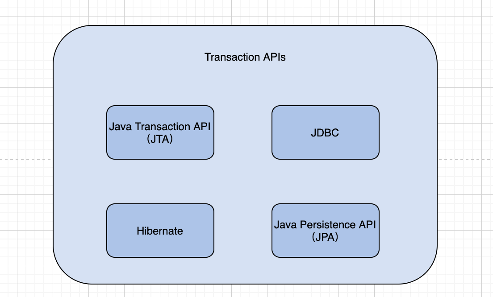
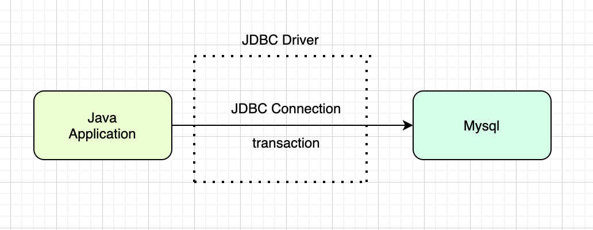
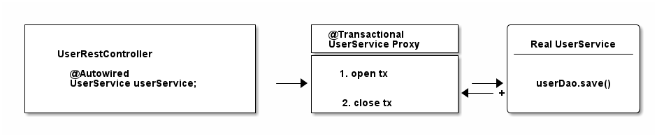
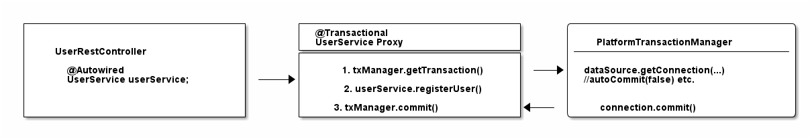
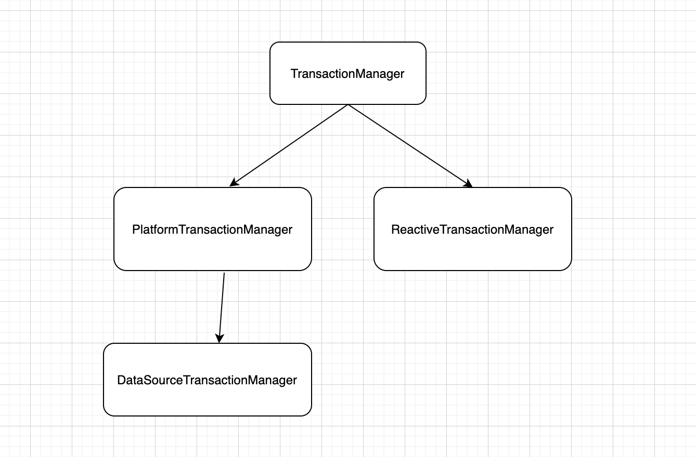
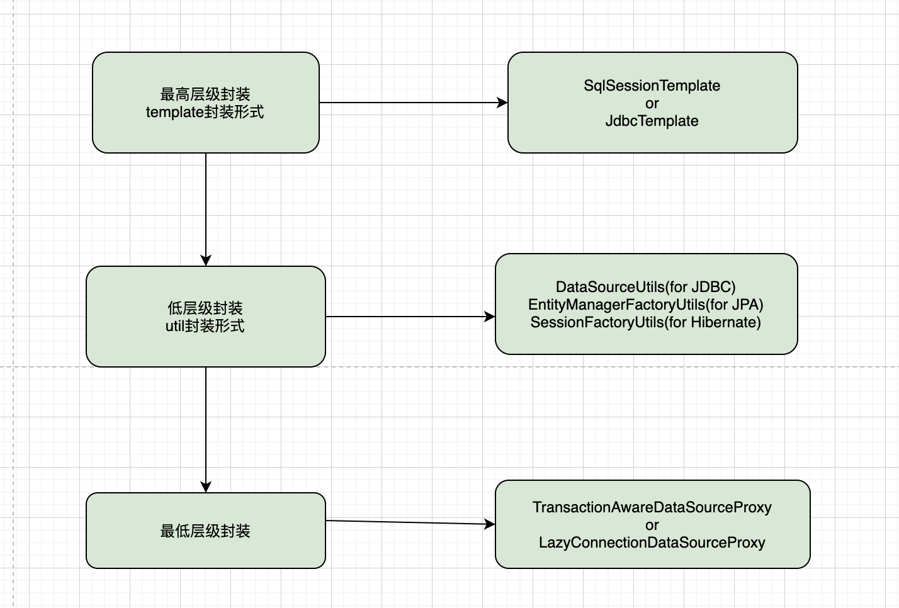

## 使用Spring事务
### Spring事务介绍
Spring事务的特点：  
1. 多种事务API，Spring事务都可兼容；  
2. 程序接入简单；  
3. 与已有的Spring框架集成。  
支持的事务API如下:  

Spring事务使用代码如下：

```
    @Transactional
    @Override
    public void testTransactional(Integer id) {
        demoDao.remove(id);
    }
```

*此为Service实现类中的一个实现方法*

### Spring事务引入
那么Spring中使用事务，我们要做的是：  
对要使用事务的类或者方法，添加注解`@Transactional`。支持事务元数据设置，比如传播特性，回滚设置等，通过AOP将设置生效。  
增加配置：`@EnableTransactionManagement`，来开启Spring中注解驱动的事务管理能力。Spring Boot中默认开启，不需要加该注解。  
一般是在Service层添加事务，然后其他层或者其他Service类来调用该事务类。
### Transaction API：JDBC
一直使用的JDBC Driver来连接数据库。
开启Spring事务之前，先看事务作用于什么？是对于数据库层来说。  
那么程序与数据库层发起一次事务如何来实现呢？首先来看Java程序与数据库的交互，是通过JDBC（Java database connectivity）来展开。JDBC是API形式，定义了客户端如何访问数据库。  
JDBC API的实现则有JDBC Driver Manager。在pom文件中，有引入过此Jar包。使用过程中，有一个连接池，来管理可用的JDBC connection。那么程序就可通过JDBC Driver来发起事务，其中事务与一个JDBC connection相关联。

事务的过程实现代码类似于：

```
import java.sql.Connection;
 
Connection connection = dataSource.getConnection(); // (1)
 
try (connection) {
    connection.setAutoCommit(false); // (2)
    // execute some SQL statements...
    connection.commit(); // (3)
 
} catch (SQLException e) {
    connection.rollback(); // (4)
}
```
可以看到事务的过程为，获取数据库连接，取消自动提交，执行SQL逻辑，然后控制正常提交，异常回滚。
### Spring事务默认设置
默认的事务能力是：
  
- 传播机制是`REQUIRED`，即当前无事务时新建一个事务，当前存在事务，则加入该事务中。  
- 隔离级别是`DEFAULT`，即使用数据库默认的隔离级别，那么数据库层默认的隔离级别是`REPEATABLE_READ` （可重复读）。  
- transaction is read-write。服务于传播机制，相对应的read-only来表明只做只读操作。
- 默认超时时间，跟随底层事务服务提供方，如果不支持超时逻辑则没有。我们使用的默认超时时间是50s。  
- 回滚机制适用于`RuntimeException`。checked Exception不会触发。

## Spring事务实现
### @Transactional实现逻辑
Spring事务是对多种Transaction API的封装，那么基于JDBC实现的封装后，通过增加`@Transactional` 注解来实现，简化了用户的使用流程。  
分析事务过程中，每次变化的是执行SQL的逻辑部分。分析如下：

Spring 提供Proxy层来实现，开启事务和关闭事务，中间过程再调用业务逻辑，即，Real UserService的userDao.save()部分。为什么说是Real？  
在Spring中我们要对某个类或者方法添加事务时，可以直接在其上添加注解 @Transactional。  
Spring内部的实现，则是依赖IoC和AOP特性。  
对含有@Transactional注解的类或者方法，提供一层Proxy实现。通过AOP实现了关联。  
对于含有@Transactional的bean，IoC容器会对该bean初始化一个代理类，也就是上面的UserService Proxy。该proxy内部对实际的service调用，实现其业务逻辑。使用时因为IoC特性，调用相应的proxy类而不是实际 service，对内部的代理逻辑我们无感知。  
那么从程序侧，实现了对事务的开启和关闭的封装，而事务与数据库连接相关联，此处Spring对数据库连接则封装在TransactionManager中，常用的功能类是PlatformTransactionManager。此处的调用逻辑如下图：

*`ReactiveTransactionManager`是响应式功能类*
### Spring事务手动控制
在一些场景下，不可用注解`@Transactional`来控制事务，需要引入手动控制逻辑时，Spring提供了封装类`TransactionTemplate`。也是对`PlatformTransactionManager`的封装，简化使用流程，类似于RedisTemplate等等。

```
@Service
public class UserService {     
    @Autowired    
    private TransactionTemplate template;     
 
    public Long registerUser(User user) {        
        Long id = template.execute(status ->  {            
            // execute some SQL that e.g.            
            // inserts the user into the db and returns the autogenerated id            
            return id;        
            });   
     }
 }
```

不必自己打开或者关闭数据库连接，并且Spring会将`SQLExceptions`转换为`RuntimeException`。

## Spring事务封装类
### Spring事务实现类
类结构如图：

AOP执行类：TransactionAspectSupport，内部是调用TransactionManager来实现事务逻辑。   
Spring对事务的封装逻辑，通过类`PlatformTransactionManager`，将指定`DataSource`的`JDBC Connection`绑定到当前线程。  
当使用`DataSource.getConnection()`时，并不是Spring封装支持的形式，可以定义`TransactionAwareDataSourceProxy`代理目标`DataSource`,在DAO层中使用该proxy类，可实现Spring的事务管理。  
`LazyConnectionDataSourceProxy`该代理类也实现了Spring的事务管理，它的优势是当要执行语句时，才从目标数据源获取连接。   
### Spring事务的不同封装层级
通过Spring封装对数据库的访问，我们可以正确创建、重用和清理持久性API资源（比如JDBC，Hibernate或JPA等），完成`DataSourceTransactionManager`到JDBC DataSource或者`HibernateTransactionManager`到Hibernate SessionFactory的事务链接到相关资源，实现Spring管理的事务。  
Spring提供了不同封装层级的数据访问操作类，使用其会支持Spring事务。如下图：


## Spring事务不生效原因
基于上面的逻辑，梳理出常见的事务不生效的原因有：

- 默认设置下，开启事务的方法必须是public。
- 类内部自调用，AOP代理不生效。
- 初始化时不生效，比如在@PostConstruct中。依赖IoC逻辑将proxy完全初始化以提供能力。
- 抛出的异常是否是RuntimeException。
- SpringBoot项目中使用多数据源切换时，TransactionManager类中加载的是否是当前数据源。
- Spring项目中，使用低层级的数据源访问方式时，检查数据源封装是否是Spring事务支持的代理类。
